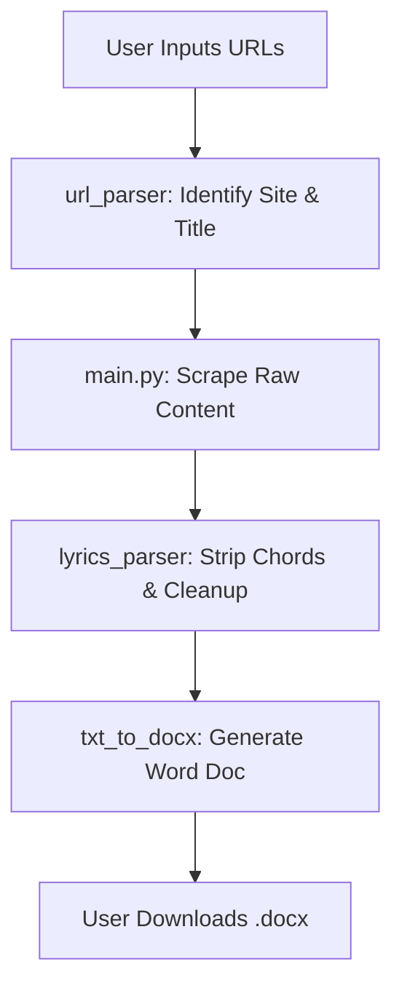

# How WorshipSheets Works

WorshipSheets is a web-based tool designed to transform chord-heavy worship songs from the web into clean, formatted lyric sheets. Here's a brief breakdown of the process:

## 1. Web Framework (FastAPI)
The application is built using **FastAPI** (`main.py`). It serves a responsive frontend (`index.html`) where users can:
- Authenticate with a password.
- Input multiple song URLs.
- Customize document formatting (font, size, columns).

## 2. Scraping & Parsing (`url_parser.py`)
When a URL is submitted:
- The app identifies the website (e.g., WorshipChords, PNWChords).
- It extracts the **Song Title** from the URL slug.
- It identifies the specific **CSS selector** needed to find the lyrics content on that particular site.
- It uses `requests` and `BeautifulSoup` to fetch and extract the raw text.

## 3. Chord Stripping (`lyrics_parser.py`)
This is the "brain" of the app. It uses regular expressions (regex) to:
- Identify and remove lines that only contain chords (e.g., "A E D Bm").
- Detect and strip inline chords (e.g., "Amazing [G] grace").
- Preserve section headers like **Verse**, **Chorus**, and **Bridge**.
- Clean up extra whitespace and formatting.

## 4. Document Generation (`txt_to_docx.py`)
The cleaned lyrics are passed to this module, which uses `python-docx` to:
- Create a professional **two-column layout**.
- Format the **Song Title** (first line) in a larger, bold font.
- Automatically detect and bold section headers (Verse, Chorus, etc.).
- Generate a `.docx` file available for immediate download.

## Process Flow Summary

